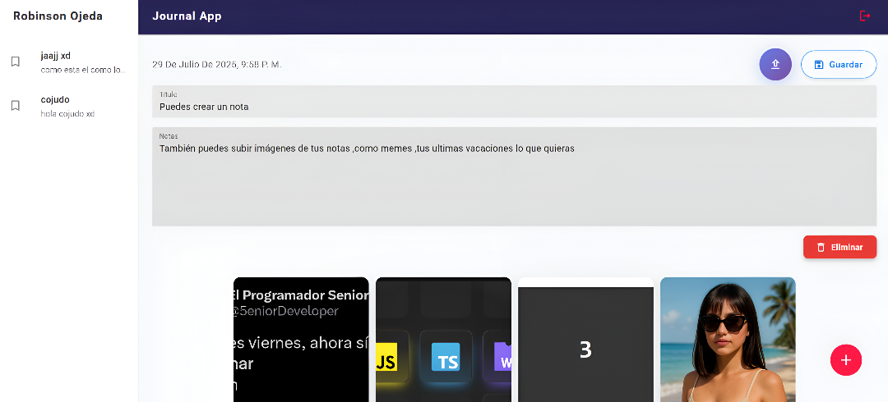

# 📝 Journal App | RaroDev

Proyecto de práctica desarrollado con tecnologías modernas. Una aplicación tipo diario digital para crear, editar y guardar notas, incluyendo la posibilidad de subir imágenes. Su diseño futurista y UI elegante lo hacen ideal para aprender buenas prácticas de desarrollo web.

---

## 🚀 Tecnologías utilizadas

- ⚛️ **React** – Librería principal para construir la interfaz
- ⚡ **Vite** – Bundler rápido para entorno de desarrollo
- 🎨 **MUI (Material UI)** – Librería de componentes modernos y responsivos
- 🔥 **Firebase** – Autenticación y almacenamiento de imágenes
- 📦 **Redux Toolkit** – Manejo de estado global
- 🎞️ **Animate.css** – Animaciones suaves y limpias
- 📁 **Cloud Storage** – Para almacenar imágenes de las notas

---

## 🧠 Funcionalidades

- Crear, editar y eliminar notas
- Subir imágenes a cada nota
- Autenticación de usuarios con Firebase
- Galería responsiva y elegante
- Animaciones al navegar o guardar
- Control de estado con Redux Toolkit
- Formato de fechas locales
- Estilo tech y futurista con diseño limpio

---

## 📸 Preview

  
> UI moderna con modo oscuro, galería de imágenes y animaciones suaves.

---

## 🔧 Instalación

1. Clona el repositorio:

```bash
git clone https://github.com/tuUsuario/journal-app-rarodev.git
